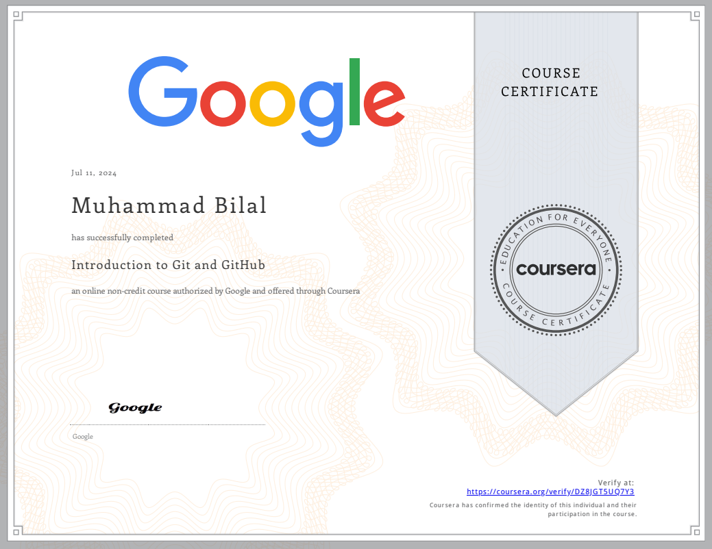

<h1 align="center"> Git and Github  </h1>

***

<h2 align="center"> A Repository to show my learning of Git and Github  </h2>

#### 🔷 What exactly is going on here?
>Git is a distributed version control system designed for tracking changes in source code during software development. It allows multiple developers to collaborate on projects, managing versions and facilitating branching for parallel development.
>GitHub is a web-based platform built around Git, providing hosting for Git repositories. It enhances collaboration by offering features like issue tracking, pull requests for code review, and project management tools. GitHub is widely used for open-source projects and by teams to streamline development workflows and ensure code quality through collaboration and version control.

***
<h3 align="center"> Google Coursera Certificate  </h3>

<h3 align="center">💣 Support this repository 💣</h3>
 

- By giving this repository a star(⭐️), you made it more visible
- Be sure to send this repository to your friends who are interested in this area
- Follow the gray cube team on other platforms

***
### 📚 Resources used 

- https://coursera.com/
- https://www.w3schools.com/
- https://www.coursera.com/

***
### 🖊 the writer : Muhammad Bilal Ashiq - [Comapny Website](https://www.entracloud.net/our-team) - [linkedin](https://www.linkedin.com/in/bilal-ashiq/)- [GitHub](https://github.com/thecallmeBilalAshiq) 
