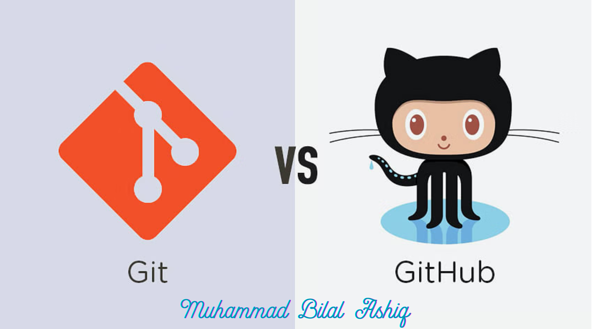

<h1 align="center">🚀 Git & GitHub - The Ultimate Guide 🎯</h1>

<p align="center">
  
</p>

---

## 📌 What is Git?
Git is a **distributed version control system** that helps developers **track changes in code** and work **collaboratively**. It allows us to manage different versions of our code and revert to previous ones if needed.

## 📌 What is GitHub?
GitHub is a **web-based hosting service** for Git repositories. It provides a visual interface to manage repositories, collaborate, and contribute to projects.

> **Simply put:** Git manages version control **locally**, while GitHub is a platform to **share** and **collaborate** on Git repositories **online**.

---

## 🔥 Why Should You Learn Git & GitHub?
✅ Helps track changes in your code 📝  
✅ Enables collaboration among developers 🤝  
✅ Allows you to work on multiple versions using branches 🌿  
✅ Helps in rolling back to previous versions 🔄  
✅ Required skill for software development jobs 💼  

---

<h2 align="center"> 🏁 Getting Started with Git </h2>

### ✅ Installing Git
To check if Git is already installed:
```sh
 git --version
```
If Git is not installed, download it from [git-scm.com](https://git-scm.com/).

### ✅ Configuring Git (First Time Setup)
```sh
git config --global user.name "Your Name"
git config --global user.email "your-email@example.com"
git config --list   # Check your configuration
```

---

<h2 align="center">🚀 Git Commands Cheat Sheet</h2>

### 🔹 Initializing a Git Repository
```sh
git init
```
This initializes a new Git repository in your project folder.

### 🔹 Cloning an Existing Repository
```sh
git clone https://github.com/username/repository.git
```
This downloads a remote repository to your local system.

### 🔹 Checking the Status
```sh
git status
```
Shows the status of modified files.

### 🔹 Adding Files to Staging Area
```sh
git add filename   # Adds a single file
git add .          # Adds all files in the directory
```

### 🔹 Committing Changes
```sh
git commit -m "Your commit message"
```
Saves the changes with a message explaining what was modified.

### 🔹 Pushing Changes to GitHub
```sh
git push origin main
```
Uploads your local commits to GitHub.

### 🔹 Pulling Changes from GitHub
```sh
git pull origin main
```
Updates your local repository with the latest changes from GitHub.

### 🔹 Creating a New Branch
```sh
git branch new-branch-name
```
Creates a new branch for feature development.

### 🔹 Switching Between Branches
```sh
git checkout branch-name
```
Switches to another branch.

### 🔹 Merging Branches
```sh
git merge branch-name
```
Combines the changes from another branch into the current one.

---

<h2 align="center">🌟 GitHub - Working with Repositories</h2>

### 🔹 Creating a Repository on GitHub
1. Go to [GitHub](https://github.com/) and sign in.
2. Click on **New Repository**.
3. Give your repository a name and description.
4. Select **Public** or **Private**.
5. Click **Create Repository**.
6. Follow the instructions to push an existing Git project or create a new one.

### 🔹 Forking a Repository
Forking means making a copy of someone else's repository to your GitHub account.

1. Open the repository you want to fork.
2. Click on **Fork** (top right corner).
3. A copy will be created in your GitHub account.

### 🔹 Creating a Pull Request (PR)
A **Pull Request** allows you to propose changes to a repository.

1. Push your branch to GitHub.
2. Go to the repository and click **New Pull Request**.
3. Add a title and description.
4. Click **Create Pull Request**.

---

<h2 align="center">📜 Best Practices</h2>

✅ Write meaningful commit messages ✍️  
✅ Use branches for new features 🔀  
✅ Keep your repository organized 📂  
✅ Regularly pull updates to avoid conflicts 🔄  
✅ Use `.gitignore` to ignore unnecessary files 🚫  

---

<h2 align="center">📚 Resources</h2>

- [GitHub Docs](https://docs.github.com/)
- [Git Tutorials](https://www.w3schools.com/git/)
- [Coursera Git Course](https://coursera.com/)

---

<h3 align="center">🎓 Google Coursera Certificate</h3>

<p align="center">
  
</p>

---

<h3 align="center">💖 Support This Repository 💖</h3>

⭐ Star this repository if you found it helpful!  
📢 Share with your friends!  
👨‍💻 Follow for more tutorials!  

---

<h3 align="center">👨‍💻 Author: Muhammad Bilal Ashiq</h3>

<p align="center">
  <a href="https://github.com/thecallmeBilalAshiq">
    
  </a>
  <a href="https://www.linkedin.com/in/bilal-ashiq/">
    
  </a>
  <a href="mailto:bashiq031@gmail.com">
    
  </a>
  <a href="https://www.instagram.com/theycallme_bilal_ashiq/">
    
  </a>
</p>
